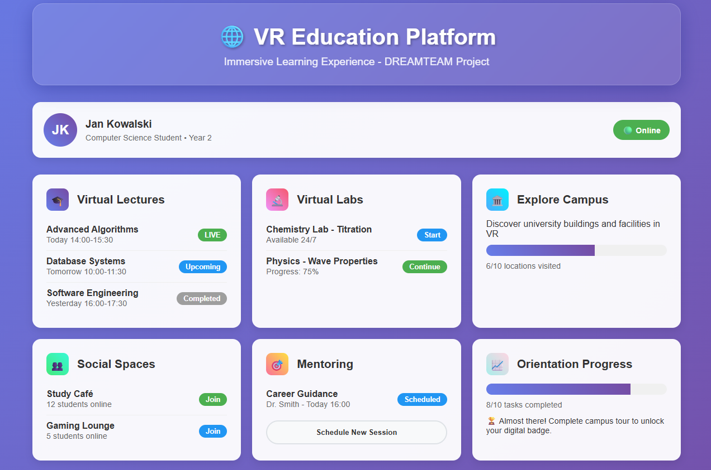

# 🎓 PM_Prototype

## 📌 Project Overview



**PM_Prototype** is a functional prototype of a VR-based educational platform. It simulates a virtual learning environment for students and lecturers, including immersive lectures, labs, campus exploration, mentoring sessions, and social spaces. It has been validated using mock data and tested with automated scenarios.

---

## ▶️ Running the Project

### 1. Install dependencies

```bash
npm install
```

2. Launch the local server (optional if using static hosting)

```bash
npx serve .
```

Or simply open index.html in your browser.

✅ Running Automated Tests (Playwright)

1. Install Playwright dependencies

```bash
npx playwright install
```

2. Run all tests

```bash
npx playwright test
```

3. View test report

```bash
npx playwright show-report
```

You can also see output of tests on photos in folder docs.

## 📦 Available Scripts

Command Description

```bash
npm run serve	#Run the static HTML server
npm test	#Run tests with Playwright and auto-server
npm run test:ui	#Run Playwright tests in interactive mode
```

---

## 🧩 Key Features

### 1. User Dashboard

-   Displays student information
-   Online/VR session status
-   Overview of all available modules

### 2. Virtual Lectures (ID_01)

-   Live, upcoming, and past lecture lists
-   Join virtual lecture halls
-   Display participants

### 3. Virtual Laboratories (ID_02)

-   Simulated chemistry and physics experiments
-   Track experiment progress
-   Step-by-step guidance

### 4. Campus Exploration (ID_03)

-   Virtual map of the university
-   Track visited locations
-   Exploration progress bar

### 5. Social Spaces (ID_04)

-   VR student café
-   Game room
-   Voice chat and interaction

### 6. Mentoring Sessions (ID_05)

-   Scheduled faculty meetings
-   Interactive whiteboard
-   Screen sharing support

### 7. Orientation Progress (ID_07)

-   Orientation task list
-   Progress bar
-   Digital badge system

---

## ⚙️ Technical Implementation

### Non-Functional Requirements

-   **Performance:** Scene loading simulated under 10s
-   **Voice Delay:** Under 150ms
-   **Scalability:** Simulated support for 100+ users
-   **Security:** Simulated TLS 1.2+ encryption

### Additional Features

-   Real-time notifications
-   Performance monitoring
-   Responsive design with glassmorphism
-   VR session simulation

---

## 📊 Mock Data

This prototype uses realistic test data including:

-   Student and lecturer profiles
-   Lecture schedules
-   Lab progress tracking
-   Orientation statistics
-   Performance metrics

---

## 🧪 Sample Test Coverage

-   Login flow
-   VR lecture room join and attendance
-   UI visibility and accessibility
-   Microphone toggle functionality
-   Navigation between modules
